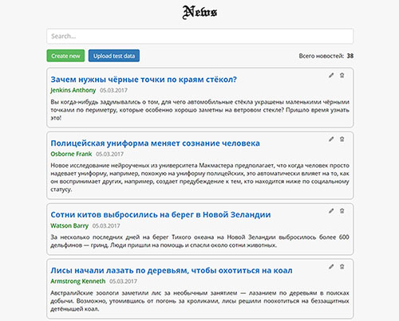

# react-news-app
<h3>Server</h3>
<ul>
    <li>NodeJS</li>
    <li>Express</li>
    <li>MongoDB</li>
</ul>
<h3>Client</h3>
<ul>
    <li>React</li>
    <li>Redux/Flux (?)</li>
</ul>
<h3>Commands</h3>

To run app:

<pre><code>npm start</code></pre>

To run API-server:

<pre><code>npm run server</code></pre>

Server config: <code>server/config.json</code>

Required MongoDB

